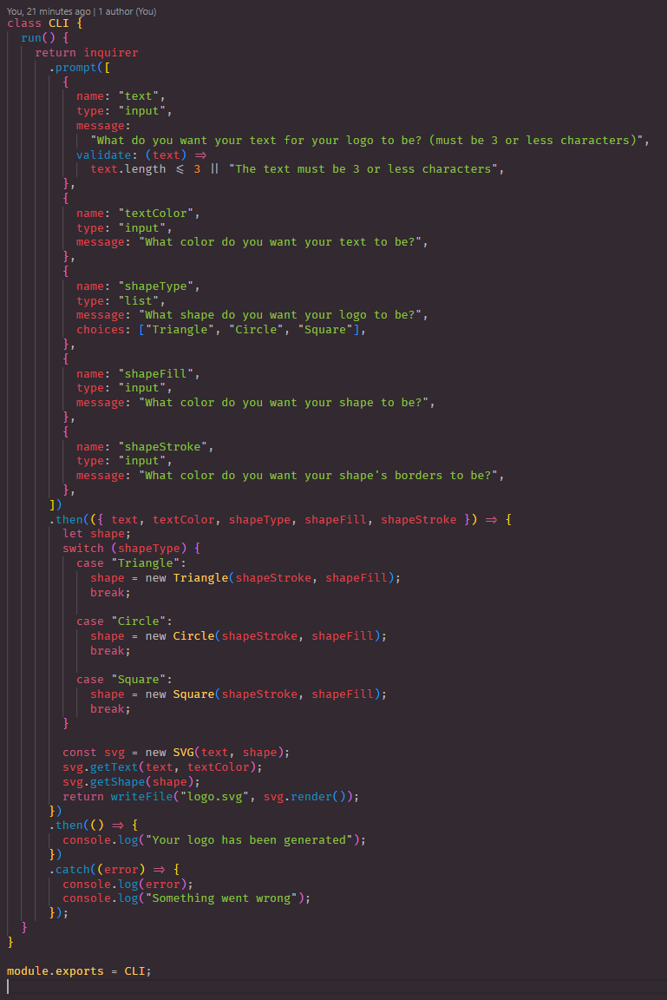
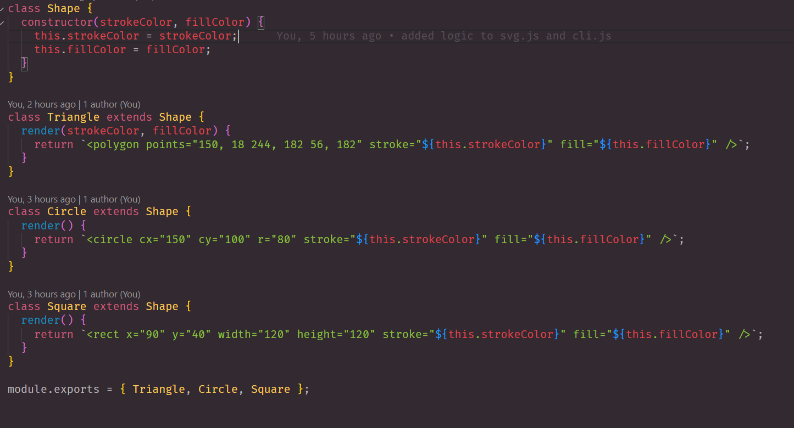
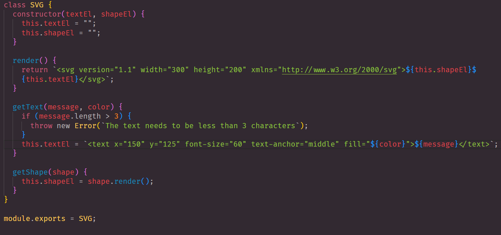
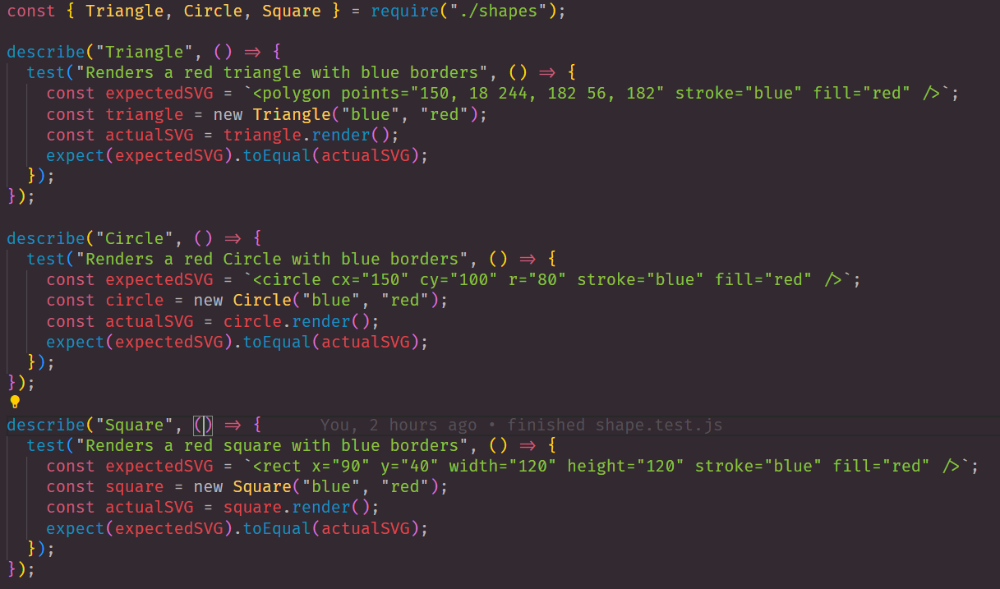
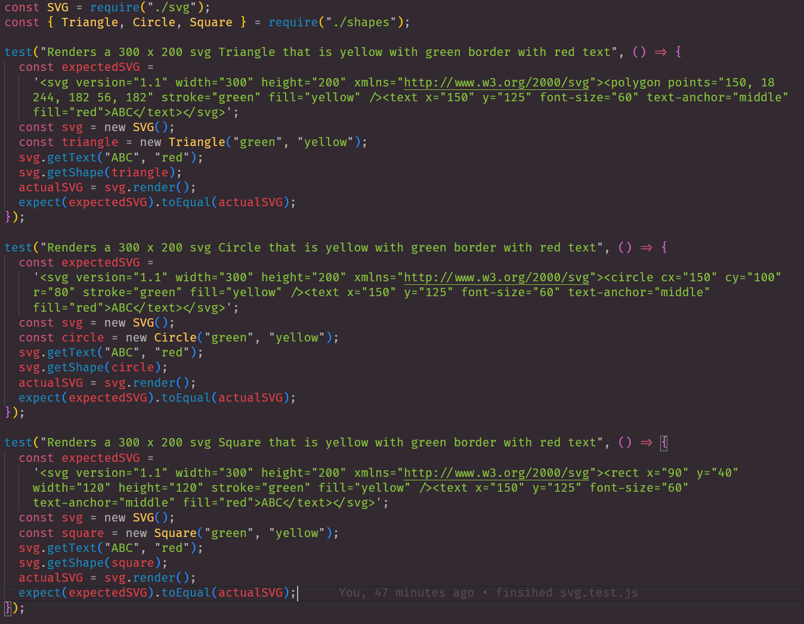
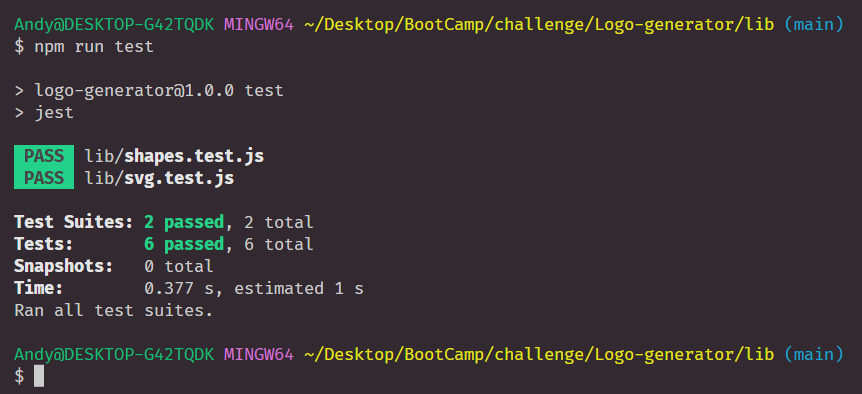
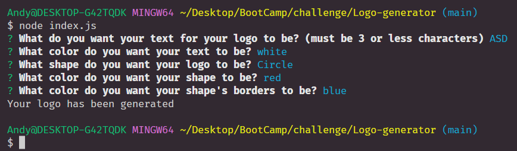

# Logo-generator
## Description
This application generates a logo for users to use if they want a quick way to make one

## Usage
Make sure to install package by putting "npm i" into the terminal then "node index.js to run the prompt. Then to install the test, put "npm i --save-dev jest" into the terminal then you can "npm run test" to test. 

## Content

This code will be invoked when you enter the terminal and enter "node index.js. 

In this code, I made a class shape with constructors to give the shapes color and border color. Then I extended the class to the other shapes. Each shape has their own code to make the shape. Then I exported to use it for my CLI file.

This is same as the one above but with different functionality. This code will get the logo's character and text color. 

Here is the test for shapes.js. This is where I test that the shape is being made. 

Here is the test for svg.js. This test to see if the whole logo is being made or not. 

Here is the test being passed. 

Here is the application being invoked and asking the questions in the prompt.
## Walkthrough Video
https://drive.google.com/file/d/12VIg8LWjyQjyf1Q6pABxtegTGTCgZAxv/view

## Links

https://github.com/thandyn/Logo-generator